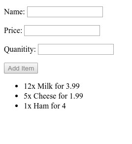
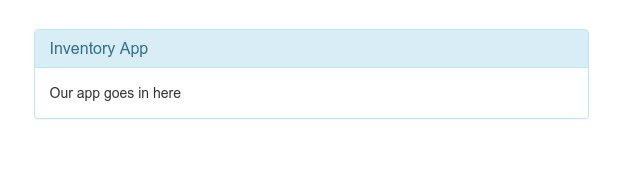
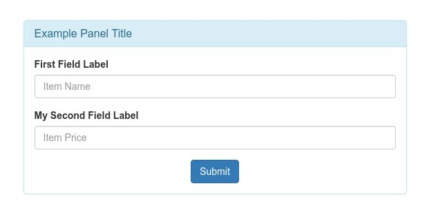
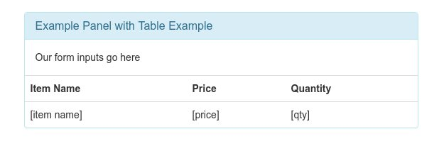
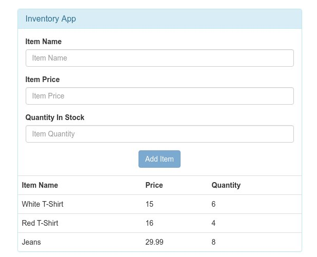
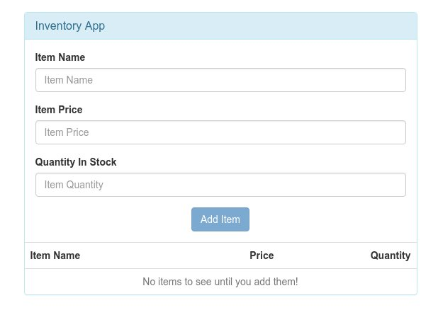
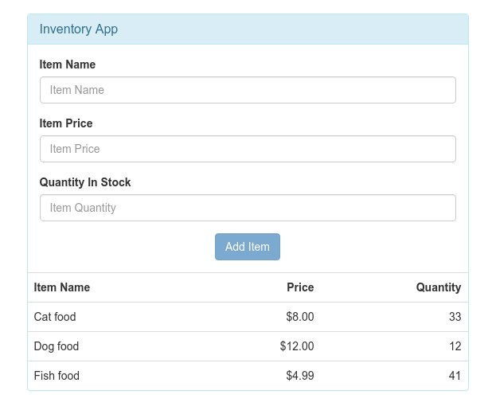

Homework for Tuesday, June 27th (Due Thursday)
==============================================

Inventory Project
------------------
Taking the [items.html](https://github.com/sergei202/okcoders-class/blob/master/week4/examples/angular/items.html) example we went over in class, start a new project called `inventory`.

Starting a new project just means put it in its own directory called *inventory* and renaming our angular module to match (don't forget to update `ng-app`).  We will be building on this example and will have more than one file, having it in its own directory will help you not get lost.

As this point you should be able to go to your `inventory/` directory and run `live-server` to start our app.


Add Quantity to Items
---------------------
We need to be able to track the quantity of our items.  Add `quantity` as a editable property for our items.  Don't let items be added if *quantity* is not a number.

At this point you should have 3 input fields (`name`,`price`,`quantity`) and have a list that displays those fields.  Your inventory project should look something like this:




Add Bootstrap
-------------
Let's make our Inventory app less ugly.  We can do that easily by adding Bootstrap.  First we need to include a link to the Bootstrap CDN in our `<head>` section:
```html
<link rel="stylesheet" href="https://maxcdn.bootstrapcdn.com/bootstrap/3.3.6/css/bootstrap.min.css">
```

Let's put add a `container`, `row`, a centered column, and a `panel` to put our app inside:
```html
<div class="container" style="padding-top:30px">    <!-- a container class puts margins to the left and right of our body, we manually add some padding-top to give us some room -->
	<div class="row">                               <!-- Bootstrap rows each have 12 columns -->
		<div class="col-sm-6 col-sm-offset-3">      <!-- Add a centered column that takes up 1/2 of the width -->
			<div class="panel panel-info">
				<div class="panel-heading">
					<h3 class="panel-title">Inventory App</h3>      <!-- Our panel title -->
				</div>
				<div class="panel-body">                            <!-- Our app markup with live here -->
					Our app goes in here
				</div>
			</div>
		</div>
	</div>
</div>
```
I added an example of this in [examples/bootstrap-panel.html](https://github.com/sergei202/okcoders-class/blob/master/week4/examples/bootstrap-panel.html):



Let's add some Bootstrap styling to our `input` elements:
```html
<div class="form-group">                            <!-- form-group is always a label and an input -->
	<label>First Field Label</label>                <!-- A text label to show to the user -->
	<input type="text" class="form-control" placeholder="Item Name" required>   <!-- Our input element with a form-control class -->
</div>
<div class="form-group">
	<label>My Second Field Label</label>
	<input type="number" class="form-control" placeholder="Item Price" required>
</div>
<div class="text-center">                           <!-- Center everything inside this div -->
	<input type="button" class="btn btn-primary" value="Submit">
</div>
```
Adding the above code into our `panel-body` we get:



The code for the above screenshot is in [examples/bootstrap-form.html](https://github.com/sergei202/okcoders-class/blob/master/week4/examples/bootstrap-form.html).

Let's transform our `<li>` list into a table:
```html
<table class="table">
	<tr>
		<th>Item Name</th>
		<th>Price</th>
		<th>Quantity</th>
	</tr>
	<tr>                                            <!-- Our ng-repeat will go on this tr -->
		<td>[item name]</td>                        <!-- Our item expressions will be inside our td's -->
		<td>[price]</td>
		<td>[qty]</td>
	</tr>
</table>
```


Example code is in [examples/bootstrap-table.html](https://github.com/sergei202/okcoders-class/blob/master/week4/examples/bootstrap-table.html).

Putting everything together, our inventory app should like something like this:




Finishing Touches
-----------------
Let's make sure that you can't add an item if any of the fields are blank.  Remember, we do this will a `ng-disabled` directive on the input button.

We can also format our prices with a `currency` filter.  Instead of `{{item.price}}` we would use `{{item.price | currency}}`

Let's align our text to the right with `text-right` all of our number `<td>` and `<th>` in the table to make them easier to read:
```html
<td class="text-right">{{item.price | currency}}</td>
```

Lastly, let's use `ng-if` to give the user a message when no items are in the table:
```html
<tr ng-if="items.length===0">      <!-- This tr only shows up if items.length is zero -->
	<td colspan=3 class="text-center text-muted">No items to see until you add them!</td>  <!-- Make one big td, center and make the text gray (text-muted) -->
</tr>
```
Our finished application:



