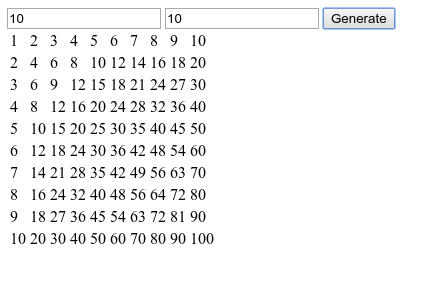

Homework for Thursday, June 30th
================================

Blog Project
------------
This will be a simple blog web app where you can add new posts and view existing ones.  The data needs to reside server-side, not client-side.

You don't need to worry about editing or deleting existing posts, just adding new ones.

**This will be your first graded project.**  Please make sure it is in it's own directory and upload to github.  It will be due Thursday, July 7th.  Start on it now, we will be discussing it Tuesday.

Multiplication Table Generator
------------------------------

You will create an Angular app that takes two numbers (rows and columns) and generates a multiplication table when a button is pressed.

You will have to use and demonstrate these areas to get this working:
- Using `$scope` properties
- Using `$scope` methods
- Using `ng-click`
- Using `ng-model`
- Using `ng-repeat`
- Generating an array of sequential numbers

Add some Bootstrap styling to make it look nice (it does not need to look like mine):

