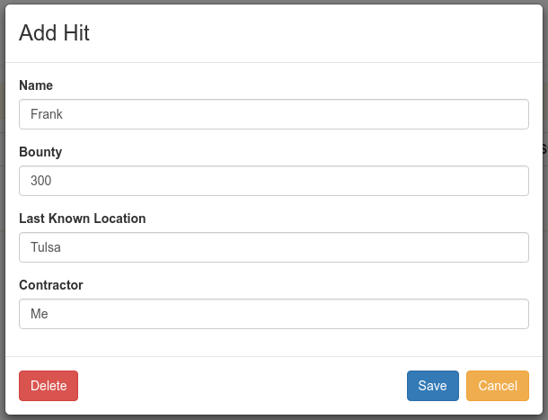
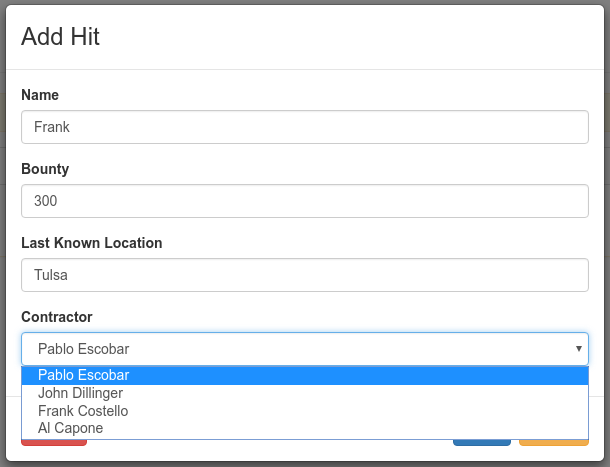
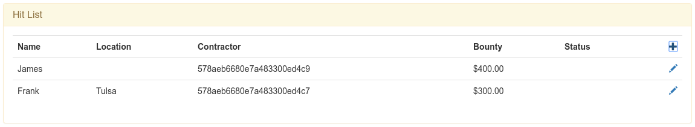
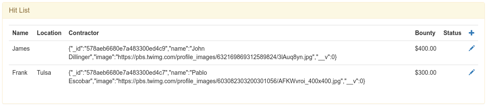
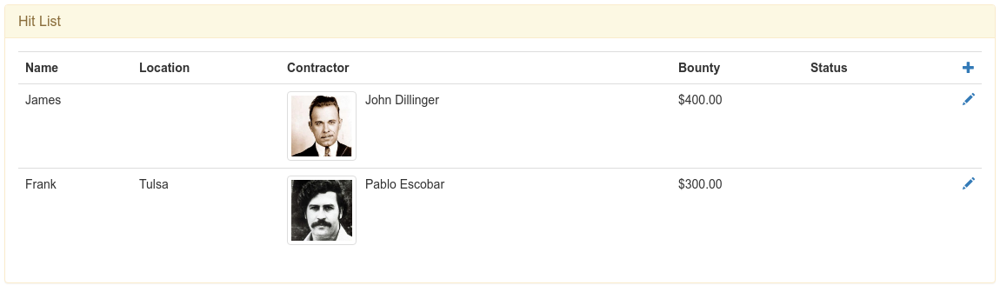
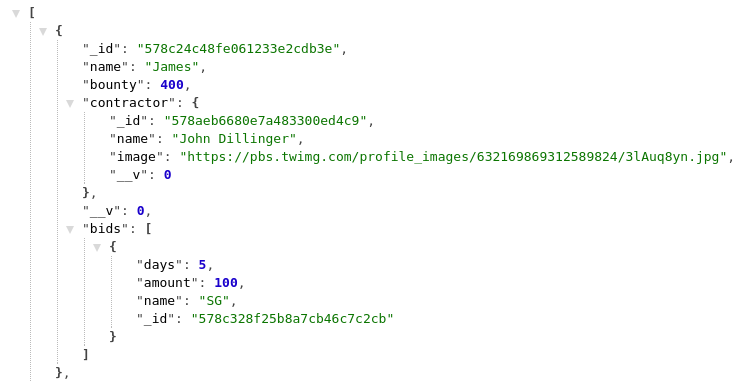
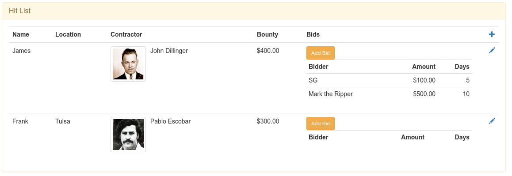
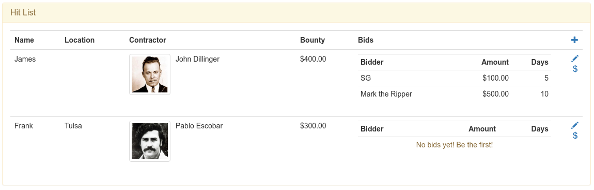

Homework for Thusday, July 14th (Due July 19th)
===============================================

Blog App: Add Post Author and Comments
--------------------------------------
Your homework will be to add a dropdown to select an author when creating each post and allow visitors to add comments to each blog post.  

To accomplish the first task, you will need to follow these basic steps:

- Create an `Author` model
- Manually add documents to our `authors` collection (since we won't have a front-end interface to add/edit authors)
- Add an `author` property to our `Post` model (don't forget the type needs to be `ObjectId` and to set `ref`)
- Add an express route to return all authors
- Add a select dropdown in the post modal that will display the author's name and use `_id` as the value
- Change the `/posts` route to populate `author`
- Display the author's name in the somewhere on the Blog

For the comments task:

- Add a property to store comments in our `Post` model (an array of objects, can simply be `name`,`body`, and `date`)
- Display and format the comments after each blog post on the client-side
- Add 'Add Comment' button and wire it up in the controller
- Create a new Comment modal (view and controller) for users to input their comments (the fields should match the `comments` structure that you added to the `Post` model)
- You will need to pass the post that the comment is being added to into the comment controller (`$uibModal.open()`'s `resolve` property)
- When the comment is saved: `push()` the comment into the `post.comments` array and POST the post to the server
- Close the modal using `$uibModalInstance.close()` after the server responds
- Refresh the list of posts to show the new comment (remember that `$uibModal.open()` returns an object that have a `result` Promise that we can use to know when the modal is closed)

The above list may seem pretty daunting at first, let's do something similar to our Hit List app step-by-step.

Hit List Example
----------------

Let's change our current Hit List app and make some improvements with what we've learned:

- Since the top 4 major contractors all use our app, let's change the Hit Contractor (text right now) to be a dropdown
- Let's allow hitmen to make *bids* on each hit

### Following Along
I created a [hitList github repo](https://github.com/sergei202/hitList) to make it easier to follow along.

If you want to follow along, clone the repo and check out the `modal` tag:

```bash
# Clone the repo
git clone https://github.com/sergei202/hitList
# Change into hitList directory
cd hitList
# Check out the modal branch and create a new branch called modal
git checkout -b modal modal
```
Install the required npm packages: `npm install`

Run: `node server.js`

### Add Contractor Support

#### Contractor Model
First we decide what data needs to be stored with each contractor document.  We only really need their name, but just for fun, let's also store their picture (as a url) so we can display their picture next to each hit.

Our documents will just consist of two properties:
```js
{
	name: 'Pablo Escobar',
	image: 'https://pbs.twimg.com/profile_images/603082303200301056/AFKWvroi_400x400.jpg'
}
```

We can now create our `Contractor` model, this will be saved in `models/contractor.js`:

```js
var mongoose = require('mongoose');

module.exports = mongoose.model('Contractor', {		// Create our Contractor model and export it
	name: String,
	image: String
});
```

#### Contractor Data
Since we already know the top 4 major contractors who use our app, let's have our app automatically generate the data if it doesn't already exist.

```js
function initContractors() {							// This function first checks if data exists and adds it if it doesn't
	return Contractor.count().then(function(count) {	// Count how many contractors are in our database
		if(count) return;								// If even one exists, don't create anymore and bail out.

		var contractors = [								// Define our list of contractors that we want inserted
			{name:'Pablo Escobar',	image:'https://pbs.twimg.com/profile_images/603082303200301056/AFKWvroi_400x400.jpg'},
			{name:'Al Capone',		image:'http://media.todaybirthdays.com/thumb_x256x256/upload/1899/01/17/al-capone.jpg'},
			{name:'John Dillinger',	image:'https://pbs.twimg.com/profile_images/632169869312589824/3lAuq8yn.jpg'},
			{name:'Frank Costello',	image:'http://p1.pstatp.com/large/5b10002c4ef3d28044c'}
		];

		contractors.forEach(function(contractor) {		// Loop through each element
			contractor = new Contractor(contractor);	// Create a document from our model
			return contractor.save();					// Save the document
		});
	});
}
```

We run this function every time our app starts, it only creates data if it doesn't exist.

#### Contractor Route
The only way for us to get data from the server-side to the client-side is by express routes.  Let's create a `/contractors` route to find and return all the contractors.

 ```js
 app.get('/contractors', function(req,res) {
 	Contractor.find().exec().then(function(contractors) {	// Find all contractors and then...
 		res.json(contractors);								// Respond with the list of contractors
 	});
 });
 ```

 Let's run our server and visit `http://localhost:8080/contractors`.  We should see:
 ```js
[
	{"_id":"578aeb6680e7a483300ed4c7","name":"Pablo Escobar","image":"https://pbs.twimg.com/profile_images/603082303200301056/AFKWvroi_400x400.jpg","__v":0},
	{"_id":"578aeb6680e7a483300ed4c9","name":"John Dillinger","image":"https://pbs.twimg.com/profile_images/632169869312589824/3lAuq8yn.jpg","__v":0},
	{"_id":"578aeb6680e7a483300ed4ca","name":"Frank Costello","image":"http://p1.pstatp.com/large/5b10002c4ef3d28044c","__v":0},
	{"_id":"578aeb6680e7a483300ed4c8","name":"Al Capone","image":"http://media.todaybirthdays.com/thumb_x256x256/upload/1899/01/17/al-capone.jpg","__v":0}
]
 ```

#### Following Along

We now have all the back-end code done to be able to list the contractors on the front-end!

You can checkout the `contractor-backend` tag to jump to this point in the tutorial:
```bash
# From the hitList directory that you cloned at the beginning
git checkout master
git pull
git checkout -b contractor-backend contractor-backend
```

#### Add Contractor Dropdown to Hit Modal
Our Hit modal currently looks like this:


Let's replace the Contractor text field with a `<select>` dropdown to list all the contractors.

Before we add the select dropdown, let's use angular's `$http.get()` to get the list from our server, we do this in our `HitCtrl` (the controller the modal is bound to).

```js
$http.get('/contractors').then(function(res) {			// GET /contractors
	$scope.contractors = res.data;						// Assign the list to $scope.contractors
});
```
We can now remove the text field and add the select dropdown to our `hit.html` markup.  We discussed two different ways to do this in class:
- Create a `<select>` and `ng-repeat` the `<option>`s
- Use `ng-options`

Let's see both examples:

```html
<select class="form-control" ng-model="hit.contractor" required>						<!-- Our select is bound to hit.contractor -->
	<option ng-repeat="con in contractors" value="{{con._id}}">{{con.name}}</option>	<!-- We ng-repeat our option tag and assign the value to _id and use name as the option label -->
</select>
```

[`ng-options`](https://docs.angularjs.org/api/ng/directive/ngOptions) is more compact but slightly less obvious what is going on:

```html
<select class="form-control" ng-model="hit.contractor" ng-options="con._id as con.name for con in contractors" required></select>
```

Let's breakdown the `ng-options`: `[value] as [label] for [item] in [array]`.  We see that we are doing exactly what we did when we manually `ng-repeat`ed through our `contractor` array, our `<option>` value is `con._id`, our label is `con.name`, and we loop through the `contractors` array and use `con` as the local item.

Both methods have the same result:



#### Populating `hit.contractor`

We are halfway there!  But now our list looks like this:



The contractor's `ObjectId` won't do much good to our users, let's replace it with the contractor's name and image.

The first thing we need to do is change the `contractor` property in our `Hit` model from a string to an `ObjectId` with a `ref`erence to the `Contractor` model.  This allows mongoose to know model to use when populating.

```js
var mongoose = require('mongoose');

module.exports = mongoose.model('Hit', {									// Create a model called Hit and export it
	name: String,
	bounty: Number,
	location: String,
	contractor: {type:mongoose.Schema.Types.ObjectId, ref:'Contractor'},	// contractor is an ObjectId that references the Contractor model
	status: String
});
```

We can now tell mongoose to populate the `contractor` property in our `/hits` route.  Our query goes from `Hit.find().sort({bounty:-1}).exec()` to `Hit.find().populate('contractor').sort({bounty:-1}).exec()`.

```js
app.get('/hits', function(req,res) {													// Return all the hits in the Hit models (the hits collection)
	Hit.find().populate('contractor').sort({bounty:-1}).exec().then(function(hits) {	// Find all hits, populate contractor, sort by bounty descending, execute, and then...
		res.json(hits);																	// Return the hits array
	});
});
```

Notice that all we did was add `.populate('contractor')` to our query!  Mongoose handles the rest for us.  Our `contractor` property in each document will no longer be an `ObjectId` but it will be the matching document from the `contractors` collection.  We can verify this by refreshing our client-side:



We can now go and change our markup in `index.html` to use the new data that became available.  Our `<td>{{hit.contractor}}</td>` will be replaced with:

```html
<td>
	 <!-- Add a small image, pulled right, with the src being contractor.image -->
	{{hit.contractor.name}}
</td>
```

Our list now looks like this.  I think we are done with the Contractor task!



#### Following Along
You can checkout the `contractor-frontend` tag to jump to this point in the tutorial:
```bash
# From the hitList directory that you cloned at the beginning
git checkout master
git pull
git checkout -b contractor-frontend contractor-frontend
```

### Bids
We want to allow hitmen to make bids on the hits listed, similar to comments made on blog posts.  
We'll only collect their name, bid amount, and days to complete the job.

#### Add Bids to Hit Model
Let's make the changes to our `Hit` model to support this new functionality.  We want to add a `bids` array of `bid` objects:

```js
bids: [{
	name: String,			// The bidder's name
	amount: Number,			// The bid amount
	days: Number			// Number of days to complete the job
}]
```

Our `hit.js` now looks like this:

```js
var mongoose = require('mongoose');

module.exports = mongoose.model('Hit', {									// Create a model called Hit and export it
	name: String,
	bounty: Number,
	location: String,
	contractor: {type:mongoose.Schema.Types.ObjectId, ref:'Contractor'},	// contractor is an ObjectId that references the Contractor model
	status: String,
	bids: [{
		name: String,			// The bidder's name
		amount: Number,			// The bid amount
		days: Number			// Number of days to complete the job
	}]
});
```

#### Bid Modal
Let's create a Bid modal to collect the data.  We're just going to copy and modify our `hit.html` modal and save it as `bid.html`:

```html
<div class="modal-header">
    <h3 class="modal-title">Add Bid</h3>
</div>

<div class="modal-body">
	<form name="bidForm">
		<div class="form-group">
			<label>Name</label>
			<input class="form-control" ng-model="bid.name" required>
		</div>
		<div class="form-group">
			<label>Bid Amount</label>
			<input type="number" class="form-control" ng-model="bid.amount" required min=0 step=100>
		</div>
		<div class="form-group">
			<label>Days to Complete Job</label>
			<input type="number" class="form-control" ng-model="bid.days" required min=0 step=1>
		</div>
	</form>
</div>

<div class="modal-footer">
	<button class="btn btn-danger pull-left" type="button" ng-click="delete()" ng-if="bid._id">Delete</button>
    <button class="btn btn-primary" type="button" ng-click="save()" ng-disabled="!bidForm.$valid">Save</button>
    <button class="btn btn-warning" type="button" ng-click="cancel()">Cancel</button>
</div>
```

Let's add a `Add Bid` button and write up it's handler in our `HitListCtrl`.
Since we're not using the `Status` column, let's re-purpose it for bids:

```html
<td>
	<button class="btn btn-warning btn-sm" ng-click="addBid(hit)">Add Bid</button>
</td>
```

Notice that the `ng-click` handler passes `hit` (created in our `ng-repeat` of `hits`).  We need to pass the `hit` object so we know where to add the bid.

Let's create our handler for `addBid()`.  We'll just copy our `loadHit()` handler and modify it a bit:

```js
$scope.addBid = function(hit) {					// addBid() will open a modal with BidCtrl, pass 'hit', and then call getHits() after it closes
	var modalInstance = $uibModal.open({
		templateUrl: 'bid.html',
		controller: 'BidCtrl',
		resolve: {
			hitItem: function() {return hit;}		// Inject our 'hit' variable as 'hitItem'
		}
	});
	modalInstance.result.then(function() {			// This executes after $uibModalInstance.close() is called from HitCtrl
		getHits();
	});
};
```

Our `BidCtrl` will again be copied from `HitCtrl` and modified:

```js
app.controller('BidCtrl', function($scope,$uibModal,$uibModalInstance,$http, hitItem) {		// Inject our dependencies and hitItem (the item we are editing)
	console.log('BidCtrl hitItem=', hitItem);
	$scope.save = function() {
		hitItem.bids.push($scope.bid);									// Push the current bid onto the bids array in hitItem
		$http.post('/hits', hitItem).then(function(response) {			// Post hitItem to our /hits POST route and then...
			console.log('post /hits: ', response.data);
			$uibModalInstance.close();
		});
	};

	$scope.cancel = function() {
		$uibModalInstance.dismiss();
	};
});
```

Notice that the only major change is that on `save()` we `push()` the current bid (`$scope.bid`) onto `hitItem.bids`.
Remember that `hitItem` is the hit that we originally passed to `addBid()` and was injected into our modal with `resolve`.

Let's add a test bid.  Nothing will show up on the front-end yet, but we can confirm it got added by going to `http://localhost:8080/hits`:



All that's left is displaying the bids in our list of hits!

#### Display Hit Bids
For the sake of simplicity, let's display the bids in the same `<td>` as the 'Add Bid' button.  We've create a table and `ng-repeat` through them:

```html
<table class="table table-condensed">
	<tr>
		<th>Bidder</th>
		<th class="text-right">Amount</th>
		<th class="text-right">Days</th>
	</tr>
	<tr ng-repeat="bid in hit.bids">
		<td>{{bid.name}}</td>
		<td class="text-right">{{bid.amount | currency}}</td>
		<td class="text-right">{{bid.days}}</td>
	</tr>
</table>
```
This is what we get:



Not very pretty.  Let's convert our button into a glyph and move it to the last column with the other glyphs.  Let's also add a row when there are no bids with some helper text.



#### Following Along
You can checkout the `bids` tag to jump to this point in the tutorial:
```bash
# From the hitList directory that you cloned at the beginning
git checkout master
git pull
git checkout -b bids bids
```
